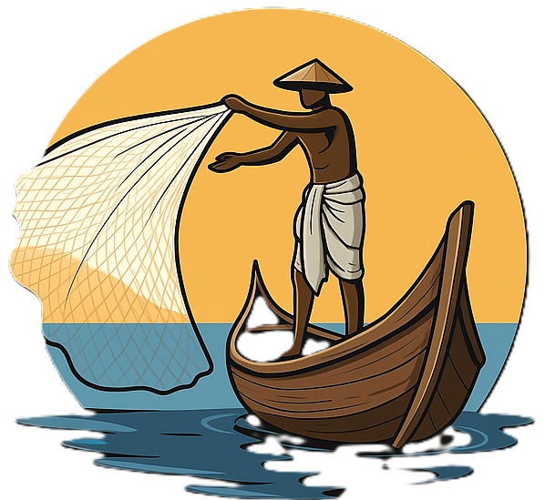

<div align="center">



# AquaSure

**AI-powered fisheries platform — built for Smart India Hackathon 2025**

[](https://react.dev)
[](https://www.typescriptlang.org)
[](https://vitejs.dev)
[](https://tailwindcss.com)
[](https://aquasure.onrender.com)
[](LICENSE)

**Team MetalMinds &nbsp;|&nbsp; SIH 2025 &nbsp;|&nbsp; Fisheries Technology Track**

[Live Demo](https://aquasure.onrender.com) &nbsp;&bull;&nbsp; [Watch Video](#demo) &nbsp;&bull;&nbsp; [Features](#features) &nbsp;&bull;&nbsp; [Tech Stack](#tech-stack) &nbsp;&bull;&nbsp; [Directory Structure](#directory-structure)

</div>

---

## Overview

India's fisheries sector still relies on manual inspection for fish species identification, freshness assessment, and price estimation — processes that are slow, error-prone, and often exploited. AquaSure addresses this with an AI-driven mobile-web prototype that automates fish identification, health analysis, and market intelligence while working **entirely offline** for core functionality.

The system includes:

- A **fisherman-facing mobile app** (this repo — React/TypeScript prototype) with on-device inference and multilingual support
- A **government/admin dashboard** (React–Node.js–SQL) for centralised monitoring, SOS alerts, and policy analytics
- A **cloud backend** (AWS) for data aggregation, market scraping, and fisherman log synchronisation

---

## Demo

<div align="center">

[](https://youtu.be/F96sPM8WEyc)

*Click the thumbnail above to watch the full AquaSure demo walkthrough*

</div>

---

## Features

### Fish Recognition & Freshness Analysis
- Capture or upload a fish photo; an on-device ML model (YOLOv8-Tiny / MobileNetV3 / Custom CNN via PyTorch Mobile) identifies the species
- Returns freshness score (0–10), confidence percentage, preservation guide, nutritional values, and estimated market price
- Works fully offline after the model is loaded

### Catch Records
- Every analysed or manually saved catch is logged with timestamp, GPS coordinates, species, weight, and quantity
- Catch history syncs to the cloud server the next time internet is available for government analytics and policy planning

### Fishing Areas Map
- Heat-map overlay of the best fishing hotspots, restricted/protected zones, and coastal guard regions
- Map tiles and zone data are cached locally so the feature works offline after initial sync

### Market Analysis
- Live fish prices, supply-demand trends, weekly bar charts, and per-species availability
- Personalized recommendations — fishermen see best selling days; consumers see best buying days
- Data is scraped from trusted sources on the backend and pushed to the app during sync windows

### Emergency SOS
- Three-mode escalation:
  1. **Satellite** — direct alert to coastal guard via satellite device (if available)
  2. **SMS** — alert via SMS in weak-signal areas
  3. **Mesh network** — relays the distress signal through a nearby boat when there is no network
- Shares exact GPS coordinates and notifies registered emergency contacts automatically

### Government Dashboard *(companion app)*
- Centralised sidebar with live stats: active fishermen, registered vessels, pending SOS alerts
- Conservation monitoring for endangered species
- Fisherman profile and licence management
- Catch tracking: species, quantities, price estimations
- Visual analytics — monthly trends and regional productivity charts
- Fishing-activity heat map with coastal coverage overlay
- Auto-generated monthly summary reports for policy review

### Accessibility & Localisation
- Regional language support: English, Hindi, Tamil, Telugu, Bengali, Marathi
- Voice command integration for non-literate users
- Role-based UX: Fisherman, Consumer, Guest

---

## Tech Stack

| Layer | Technology |
|---|---|
| UI Framework | React 18 + TypeScript |
| Build Tool | Vite 6 |
| Styling | Tailwind CSS |
| Component Library | Radix UI primitives |
| Charts | Recharts |
| Icons | Lucide React |
| Mobile Runtime (planned) | Kotlin + Jetpack Compose + SQLite (Room ORM) |
| On-device ML (planned) | YOLOv8-Tiny, MobileNetV3, Custom CNNs via PyTorch Mobile |
| Cloud Backend | AWS (data aggregation, sync, market scraping) |
| Admin Dashboard | React + Node.js + SQL |
| Hosting (prototype) | Render (static site) |

---

## Directory Structure

```
AquaSure/
├── public/
│   └── favicon.png                  # App icon
├── src/
│   ├── components/
│   │   ├── ui/                      # Radix UI + Tailwind component primitives
│   │   ├── figma/                   # Figma-generated helper components
│   │   ├── RegisterScreen.tsx       # Onboarding — name, role, language selection
│   │   ├── HomeScreen.tsx           # Dashboard with main feature navigation
│   │   ├── CameraScreen.tsx         # Fish capture / upload interface
│   │   ├── FishResultScreen.tsx     # ML result — species, freshness, market value
│   │   ├── CatchLogScreen.tsx       # Historical catch records with geo/time data
│   │   ├── MapScreen.tsx            # Fishing hotspots & restricted zones map
│   │   ├── MarketAnalysisScreen.tsx # Price trends, supply-demand charts
│   │   └── SOSScreen.tsx            # Emergency SOS with multi-mode escalation
│   ├── styles/                      # Global style overrides
│   ├── App.tsx                      # Root component — screen router & user state
│   ├── index.css                    # Tailwind base imports
│   ├── main.tsx                     # React entry point
│   └── vite-env.d.ts                # Vite type declarations
├── index.html                       # HTML shell
├── package.json
├── render.yaml                      # Render deployment config
├── vite.config.ts
└── README.md
```

---

## Goals

| Goal | Status |
|---|---|
| Automate fish species identification | Prototype complete (mock ML, full UI flow) |
| Offline-first architecture | Core screens work offline; sync on reconnect |
| Multilingual support for non-literate users | 6 languages wired; voice commands planned |
| Accurate freshness scoring | UI complete; ML pipeline integration pending |
| Real-time market price intelligence | Cached data flow implemented; live scraper in cloud |
| Emergency SOS with 3-mode escalation | Full UI + alert logic complete |
| Government monitoring dashboard | Companion app scope defined; charts and stats ready |
| Conservation & compliance tracking | Dashboard feature designed; data integration pending |

---

## Getting Started

### Prerequisites

- Node.js 18 or higher
- npm 9 or higher

### Installation

```bash
# Clone the repository
git clone https://github.com/prince7z/AquaSure.git
cd AquaSure

# Install dependencies
npm install

# Start the development server
npm run dev
```

Open [http://localhost:5173](http://localhost:5173) in your browser.

### Production Build

```bash
npm run build
```

The output is written to `./build` and can be served as a static site (see `render.yaml`).

---

## Team

**MetalMinds** — Smart India Hackathon 2025

> Built with purpose for India's 16 million fishermen.

---

<div align="center">

[](https://www.sih.gov.in)
[](https://github.com/prince7z/AquaSure)

</div>
